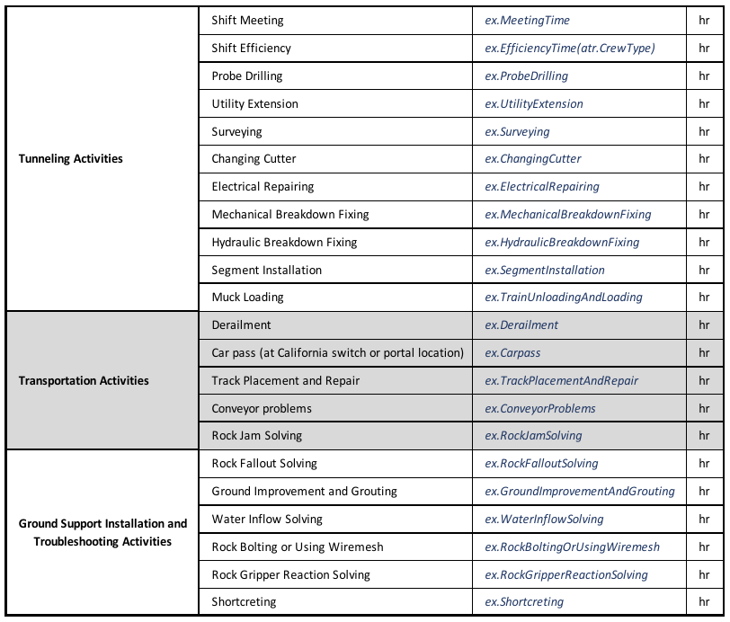
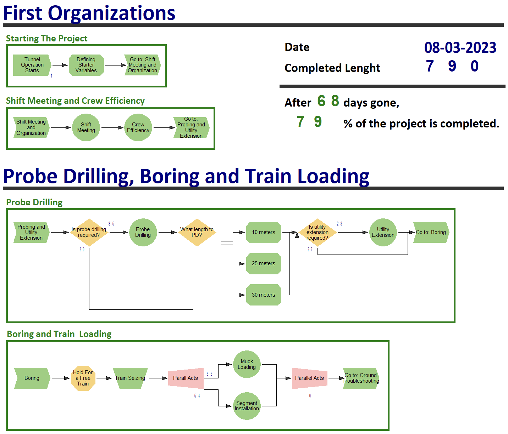

# TBM Tunneling Process Simulation

## Overview

This project involves simulation modeling of the TBM (Tunnel Boring Machine) tunneling process. The simulation was conducted using the Arena simulation software. The primary objective was to create a detailed model of the tunneling process, allowing for analysis and optimization of various aspects of TBM operations.

  

## Purpose

This project was completed as part of the Simulation course at Sharif University of Technology, under the guidance of Dr. Hassannayebi. The aim was to apply simulation techniques to real-world engineering problems, specifically focusing on underground tunnel construction using TBM technology.

## Problem Definition and Context

To effectively model the TBM tunneling process, it is essential to understand the different types of activities involved, the associated delays, and their durations. The following tables provide detailed information on the tunneling activities and the expressions used in the simulation.

  

This table lists various tunneling activities and their related delay types, providing an essential overview of the processes modeled and how they are measured in the simulation.

  

This table details the statistical expressions used for each activity, showcasing how the simulation accounts for different factors affecting tunneling operations.

## Tools and Methods

<strong>Simulation Software:</strong> Arena  
<strong>Modeling Approach:</strong> Discrete Event Simulation (DES) was used to model the TBM tunneling process. This approach allows for the simulation of complex interactions and events that occur during tunneling operations.

  

## Process Definition

Key tunneling activities and various operational scenarios were defined, including maintenance, transportation, and support installation activities. Below are the primary components and stages of the process modeled:

### First Organizations

The project begins with initial setup activities, including defining starter variables and organizing shift meetings.

  

### Probe Drilling, Boring, and Train Loading

This stage includes probe drilling to assess ground conditions and train loading for transporting excavated materials.

  

### Ground Troubleshooting and Fixing Tools

This section addresses troubleshooting ground issues and fixing tools during the tunneling process.

  

### Transportation

Managing transportation logistics, including train utilization and addressing issues related to train operation and track maintenance.

  

### Surveying Check and End of The Cycle

Surveying activities are conducted to check the tunnel alignment and ensure the accuracy of tunneling progress, marking the end of a cycle.

  

## Resource Allocation

The simulation model includes detailed modeling of resource usage, such as TBM equipment, labor, and supporting machinery. Key resources are monitored to assess utilization rates and identify potential inefficiencies.

## Statistical Analysis

<strong>Performance Metrics:</strong> Key metrics, such as tunneling speed, downtime, and resource utilization, were analyzed to identify inefficiencies and optimize operations.  
<strong>Optimization Scenarios:</strong> Various scenarios were tested to determine optimal configurations for maximum efficiency.

## Results

The simulation results provide insights into the efficiency of TBM operations, including the impact of various factors such as equipment breakdowns and maintenance schedules. These results can inform better planning and operational strategies in real-world TBM tunneling projects.

## Replication of Prior Works

This project is a replication of the following studies:

1. A. Khetwal, J. Rostami, P.P. Nelson, "Introducing uniform discrete event simulation (CSM2020) for modeling the TBM tunneling process," <em>Tunnelling and Underground Space Technology</em>, vol. 125, 2022.  

2. A. Khetwal, J. Rostami, O. Frough, and P. P. Nelson, "Comparison between discrete event simulation approach and various existing empirically-based models for estimation of TBM utilization," <em>Tunnelling and Underground Space Technology</em>, vol. 112, 2021.  

3. O. Frough, A. Khetwal, and J. Rostami, "Predicting TBM utilization factor using discrete event simulation models," <em>Tunnelling and Underground Space Technology</em>, vol. 87, 2019.

